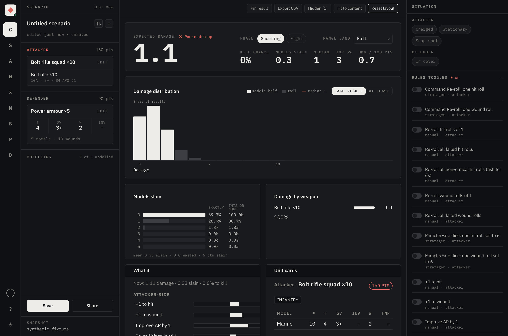
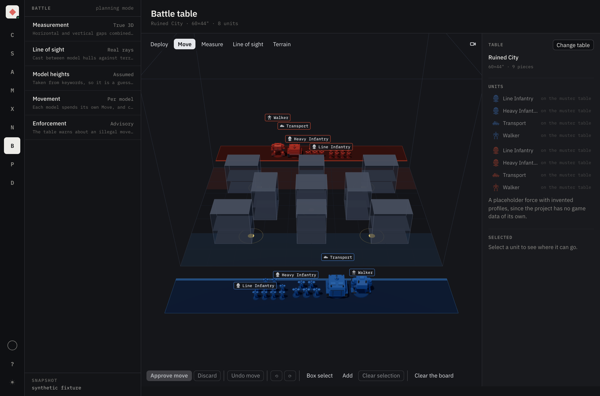
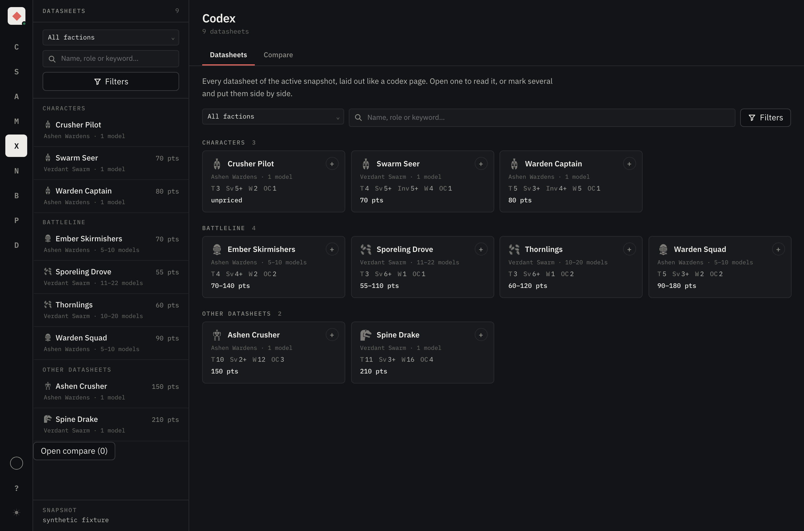

# Grimstat

An unofficial, fan-made statistics dashboard and army builder for Warhammer 40,000. It runs in your
browser, keeps what you make on your device, and ships no Games Workshop data.

### **[grimstat.com](https://grimstat.com)**

The app is free. It has no adverts and no purchases, and it does not require an account. There is
an Android build of the same app.

---

The calculator answers one unit against another as a whole distribution. Expected damage, the chance
of killing the target outright, models slain, damage per 100 points, and a what-if panel that ranks
which single change moves the result most.

## What it does

- **Calculator** — exact probability distributions rather than averages, so the tail is visible.
  Monte Carlo is the fallback, used only where an exact answer is out of reach.
- **Army builder** — 11th-edition validation while you type: Detachment Points, Leader and Support
  attachment, tiered unit costs, enhancements, transport capacity.
- **Codex** — every datasheet of your snapshot laid out like a codex page, and any two to six of
  them side by side with the best value in each row marked.
- **Battle table** — a 3D board with line of sight cast as real rays between model hulls,
  measurement that counts the vertical gap, per-model movement, and terrain.
- **Collection** — the models you own, counted per datasheet and filled in a box at a time from a
  catalogue of 223 boxed sets.
- **Meta** — an army measured against the published tournament lists of its faction: which units the
  field takes, where this list has more or fewer or none, and the lists it most resembles.

The battle table, with two deployment zones, terrain and a placeholder force on a 60×44" board.

The codex, showing every datasheet in the loaded snapshot grouped by role.

Every screenshot uses the app's built-in sample data, which is invented units with invented profiles.
No Games Workshop data appears in any of them. Loading your own snapshot replaces the sample.

## What is in this repository

The application source is private. This is the project's front page, the place to report a fault, and
a couple of pieces of the code that are worth reading on their own.

All of it is [MIT licensed](LICENSE) and free to reuse.

**[`engine/`](engine/)** — the probability engine behind the calculator, extracted whole and
runnable. It turns an attack sequence into a full damage distribution, exactly where that is
affordable and by sampling where it is not. No dependencies. `npm test` runs 37 tests, including
property-based ones and Monte Carlo runs checked against the exact solver.

**[`server/`](server/)** — the files the privacy notice makes claims about: every migration, the
purge job, sign-in, share links and the hashing. [`server/README.md`](server/README.md) maps each
sentence of the notice to the file that settles it, so the retentions can be checked rather than
taken on trust.

## Reporting a fault

[Open an issue](https://github.com/N041M/grimstat/issues). What helps most:

- What you did, what you expected, and what happened instead.
- Which screen, and whether you were signed in.
- The browser, and whether it is a phone, a tablet or a desktop.
- For anything involving your own army data, a description rather than an export. Nothing here needs
  your lists, and an issue is public.

## Privacy

What the server holds, why, and for how long is at
**[grimstat.com/#/privacy](https://grimstat.com/#/privacy)**. The app works without an account and
keeps everything on your device. An account is optional and carries what you made to your other
devices.

## Data

No Games Workshop rules text, datasheets, points or artwork is part of the app or of this repository.
The app ships importers, and you fetch game data onto your own machine from community sources:
BSData, the online Munitorum Field Manual, and Wahapedia's CSV export.

Two public dataset repositories support that:

- [`grimstat-wahapedia`](https://github.com/N041M/grimstat-wahapedia) — a weekly copy of Wahapedia's
  own CSV export, which a browser cannot read directly because wahapedia.ru sends no cross-origin
  header. It carries Wahapedia's attribution requirement: Powered by Wahapedia, https://wahapedia.ru.
- [`grimstat-corpus`](https://github.com/N041M/grimstat-corpus) — published tournament lists, which
  the Meta screen measures an army against.

Warhammer 40,000 and all associated marks are the property of Games Workshop Limited. This project is
not affiliated with, endorsed by, or sponsored by Games Workshop.

## Licence

[MIT](LICENSE), for everything in this repository.

The Grimstat application itself is not published here and is not covered by it. Neither is anything
belonging to Games Workshop.
